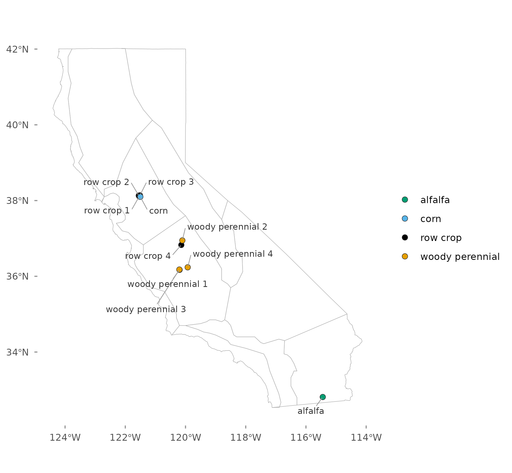
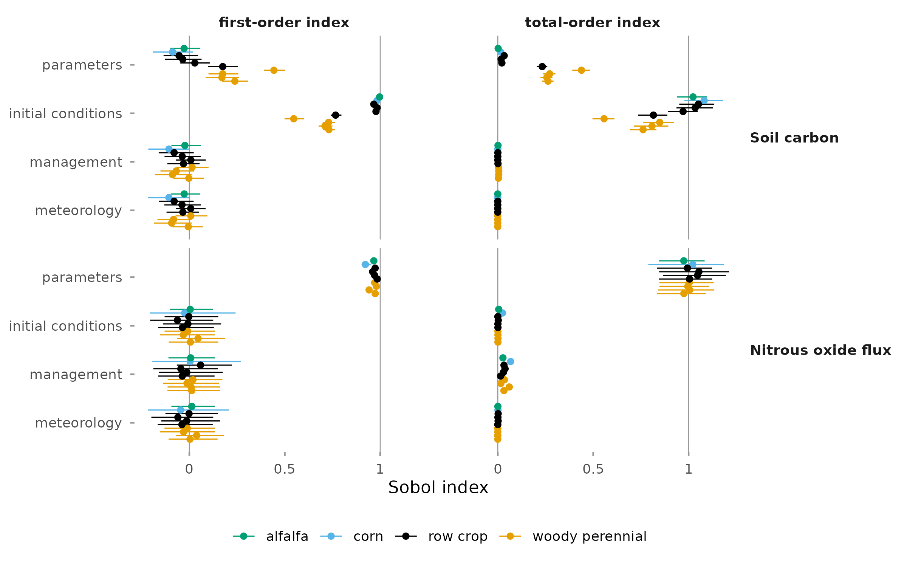
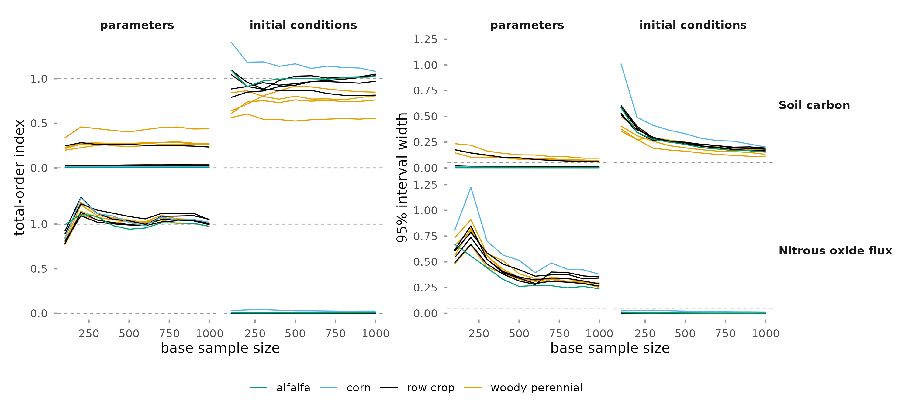

This report partitions the variance of modeled soil carbon and N₂O-N flux among four
inputs: model parameters, initial conditions, meteorology, and management. The analysis
covers 10 design points on California cropland over 2016 to 2023. Results are indices
with 95 percent bootstrap intervals at each design point.

## Background

The one-at-a-time analysis, reported separately, ranks individual parameters but holds
meteorology, initial conditions, and management at one realization. A variance-based
global sensitivity analysis varies all four inputs together and assigns each a share of
the output variance ([Saltelli et al., 2008](references.html)).

Two indices are reported for each input. The first-order index is the share of output
variance from that input alone. The total-order index adds its interactions with the
other inputs. The indices use a variance-based Sobol design with two independent base
samples of 1,000 rows that are recombined to vary each input separately
([Jansen, 1999](references.html); [Saltelli et al., 2010](references.html)). Parameters
are treated as one input and are not ranked individually.

{#fig-map width=70% fig-align="center" .lightbox fig-alt="Map of California with 10 labeled design points: four row crop and one corn in the Sacramento-Delta, four woody perennial and one row crop in the San Joaquin Valley, and one alfalfa in the Sonora Desert."}

| Setting | Value |
|---|---|
| Model | SIPNET 2.2.0, nitrogen cycle and anaerobic processes on |
| Design points | 10: 4 woody perennial, 4 row crop, 1 corn, 1 alfalfa |
| Period | 2016 to 2023, reported as the mean over the period |
| Parameters | PFT priors of the statewide inventory runs |
| Meteorology | 10 ERA5 ensemble members |
| Initial conditions | first 20 of the 50 inventory members |
| Management | 20 inventory ensemble members |
| Model runs | 6,000 per design point |
| Intervals | 95 percent, from 1,000 bootstrap resamples |

: Configuration of the analysis. {#tbl-config}

## Share of output variance by input

{#fig-partition width=100% fig-align="center" .lightbox fig-alt="Stacked horizontal bars, one per design point, showing the share of variance from parameters, initial conditions, management, meteorology, and an unexplained part, for soil carbon and modeled N2O-N flux."}

| Output | Input | Median | Range across design points |
|---|---|---:|---:|
| Soil carbon | Initial conditions | 0.91 | 0.56 to 1.08 |
| | Parameters | 0.13 | 0.00 to 0.44 |
| | Management | 0.00 | 0.00 to 0.01 |
| | Meteorology | 0.00 | 0.00 to 0.00 |
| Modeled N₂O-N flux | Parameters | 1.00 | 0.97 to 1.05 |
| | Management | 0.03 | 0.01 to 0.07 |
| | Initial conditions | 0.00 | 0.00 to 0.03 |
| | Meteorology | 0.00 | 0.00 to 0.00 |

: Total-order index of each input across the 10 design points. {#tbl-indices}

Initial conditions account for most of the variance in mean soil-carbon stock, and
parameters for most of the variance in modeled N₂O-N flux, at every design point.
Management and meteorology together have first-order indices of at most 0.06
for either output.

## Variation across design points

{#fig-sites width=100% fig-align="center" .lightbox fig-alt="First-order and total-order indices with 95 percent intervals at each of the 10 design points, for each input and for soil carbon and modeled N2O-N flux."}

For soil carbon, the total-order index of parameters is 0.23 to 0.44 at the five design
points in the San Joaquin Valley and at most 0.03 at the other five. For modeled N₂O-N flux,
the index of parameters is 0.97 to 1.05 at every design point.

The intervals of the largest indices are 0.11 to 0.20 wide for soil carbon and 0.24 to
0.40 wide for modeled N₂O-N flux. Estimates above 1 or below 0 have intervals that include
that bound.

## Precision of the indices

{#fig-convergence width=100% fig-align="center" .lightbox fig-alt="Line plots of total-order index and interval width against base sample size from 100 to 1,000, one line per design point, for parameters and initial conditions and for soil carbon and modeled N2O-N flux."}

The input with the largest index at each design point and output is the same at every
base sample size from 100 to 1,000. Index values are reported with their intervals.

## Reporting scope

Indices are reported for soil carbon and modeled N₂O-N flux. Methane is addressed in
the local analysis only; this global analysis does not establish a reliable methane
variance partition. Aboveground biomass and net ecosystem exchange were also computed.
Plant carbon is low in these runs, with median aboveground biomass below 0.4 kg C m^-2^
at every design point; indices for these two outputs are not presented.

## Interpretation

These are model-derived results. Parameters are drawn from priors that have not been
updated with observations, and each index depends on the prior widths and on the spread
of the input ensembles.

The meteorology index measures the spread among the 10 ERA5 members, which differ by at
most 0.10 °C in mean air temperature; it is not a sensitivity to climate. The management
index measures the spread among the 20 management members; it is not the effect of a
change in practice. Initial nitrogen and litter pools are the same in every run, so the
initial condition index does not include uncertainty in those pools.

See [References](references.html) for the cited sources.
