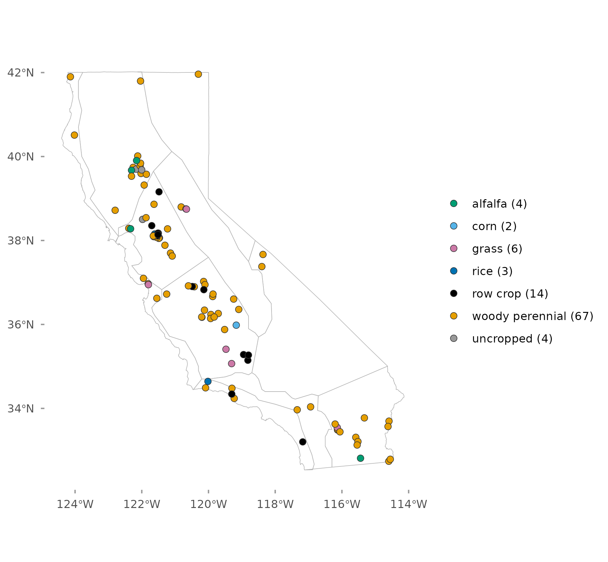
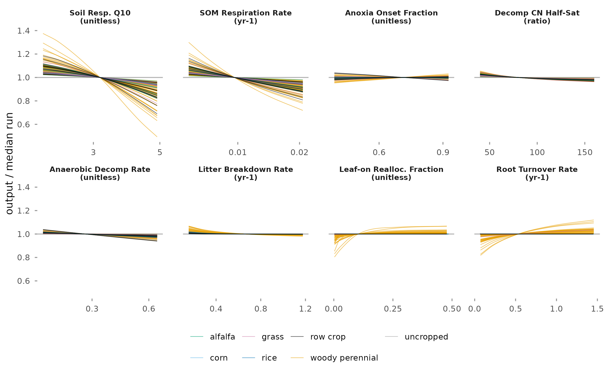
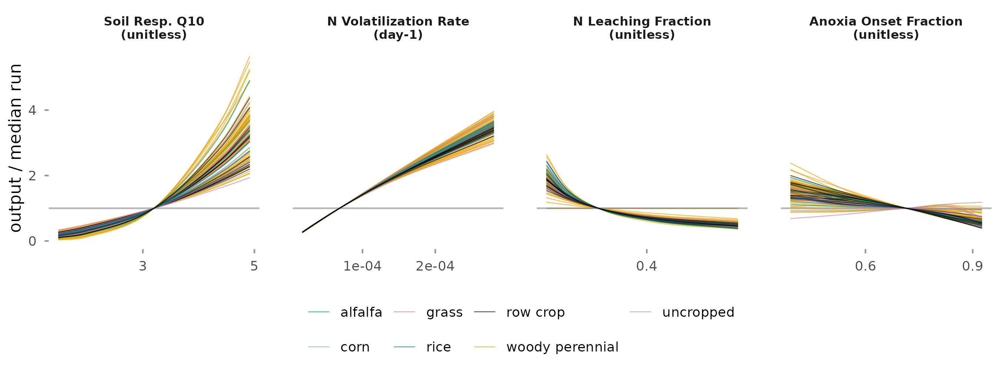

# Key Findings

This report presents a one-at-a-time (OAT) sensitivity analysis of the SIPNET ecosystem
model at 100 design points on California cropland, for soil carbon, nitrous oxide flux,
and methane flux.

-   **Soil carbon.** Two soil parameters, the temperature sensitivity of soil
    respiration and the soil organic matter (SOM) respiration rate, have median shares
    of 62 and 28 percent of the parameter variance. Raising either lowers soil carbon at
    all 100 design points.
-   **Nitrous oxide.** The same temperature sensitivity and the nitrogen volatilization
    rate have median shares of 46 and 40 percent. In SIPNET the nitrous oxide output is
    the nitrogen volatilization flux, which scales with both parameters.
-   **Methane.** Modeled methane is near zero at every design point; the soil methane
    rate prior has a median of 1.4 × 10^-9^ day^-1^. Where methane is not exactly zero,
    the soil methane rate has a median share of 99 percent.
-   **Plant parameters.** A single plant parameter exceeds 5 percent of the soil carbon
    variance at 19 of the 96 cropped design points, 18 of them woody perennial. Plant
    carbon inputs are small in these runs (see Limitations), which limits how much plant
    parameters can affect soil carbon and nitrous oxide.

------------------------------------------------------------------------

# Background {#sec-background}

## Why sensitivity and uncertainty analysis?

Process-based ecosystem models encode how carbon, water, and nutrient cycles interact.
When they are used for prediction, the reliability of the predictions depends on how well
the model's parameters are known.

Sensitivity analysis asks which parameters the model responds to most strongly. Sensitivity
alone can mislead: a sensitive parameter with a narrow prior may contribute little to
predictive uncertainty, while a moderately sensitive parameter with a wide prior can
dominate it. Uncertainty analysis combines model sensitivity with prior parameter
uncertainty to estimate each parameter's contribution to predictive variance (LeBauer et
al., 2013; Dietze et al., 2014).

## Approach {#sec-approach}

The analysis uses the PEcAn variance decomposition workflow (LeBauer et al., 2013;
@fig-workflow):

1.  **Priors.** Each parameter has a prior distribution. Priors are set per plant
    functional type (PFT), so all design points of a PFT share the same priors. This run
    uses priors only; no meta-analysis was run to update them.
2.  **One-at-a-time sensitivity runs.** SIPNET is run with every parameter at its prior
    median, then with each parameter moved in turn to the 2.3, 15.9, 84.1, and 97.7
    percentiles of its prior (the quantile equivalents of $\pm 1\sigma$ and
    $\pm 2\sigma$), all other parameters at their median. A spline is fit through the
    five outputs, and elasticity is computed from its slope at the median:

    $$\varepsilon = \frac{\partial Y}{\partial X} \cdot \frac{X}{Y}$$

    An elasticity of 2 means a 1 percent increase in the parameter produces a 2 percent
    increase in the output. The sign gives the direction.

3.  **Variance decomposition.** Each parameter's prior is propagated through its spline,
    and the variance of the result is that parameter's contribution to predictive
    variance. This report expresses each contribution as a **share of parameter
    variance**: its variance over the sum across all plant and soil parameters at that
    design point and output. PEcAn's own partial variance normalizes plant and soil
    parameters separately; the joint share shows which group dominates an output.

A parameter is treated as influential where its share exceeds 5 percent, the criterion
Fer et al. (2018) used to select SIPNET parameters for calibration.

{#fig-workflow width=90% fig-align="center"}

## Study design {#sec-design}

The analysis covers the first 100 design points of the statewide design in
farthest-point order (@fig-map). Each design point runs under its vegetation PFT from the
statewide inventory site table, plus the soil PFT, which holds the soil biogeochemistry
parameters: 67 woody perennial, 14 row crop, 6 grass, 4 alfalfa, 3 rice, 2 corn, and 4
uncropped design points with the soil PFT only.

{#fig-map width=70% fig-align="center"}

Each cropped design point varies 34 parameters (21 plant, 13 soil) and each uncropped
design point 13. Parameters whose prior has no spread are run but contribute no variance
and are excluded from the decomposition.

| Setting | Value |
|---|---|
| Model | SIPNET 2.2.0 (commit `3ccc41c`), nitrogen cycle and anaerobic processes on |
| Period | 2016 to 2023, reported as the mean over the period |
| Outputs reported | Soil carbon stock, nitrous oxide flux, methane flux |
| Parameter priors | PFT priors of the statewide inventory runs |
| Inputs | Member 1 of the ERA5 meteorology, initial condition, and management ensembles |
| Model runs | 13,364 (137 per cropped design point, 53 per uncropped design point) |

: Configuration of the sensitivity runs. {#tbl-config}

------------------------------------------------------------------------

# Results {#sec-results}

## Uncertainty, sensitivity, and share {#sec-components}

Which parameters contribute most to predictive uncertainty? @fig-components shows, for
each influential parameter, its prior uncertainty (CV), the model's sensitivity to it
(elasticity), and its share of parameter variance.

![Prior uncertainty (CV), sensitivity (elasticity), and share of parameter variance. Points are medians across design points and bars span the interquartile range. CV is the same at every design point because each parameter has one prior. Plant parameters are summarized over all 96 cropped design points, so their medians are near zero. Methane elasticities use only the 16 design points where the median run produces methane. Rows are soil parameters over 5 percent at any design point and plant parameters over 5 percent at five or more.](figures/variance_components.png){#fig-components width=100% fig-align="center"}

## Variation across design points and PFTs {#sec-variability}

How much do the shares vary across design points, and do they differ between PFTs?
@fig-pft shows the distribution of each parameter's share across design points and its
mean share by PFT.

{#fig-pft width=100% fig-align="center"}

## Response curves {#sec-curves}

@fig-panel shows the prior and the model response for the soil parameters at one design
point, a row crop design point in the San Joaquin Valley whose soil parameter shares lie
close to the median across all 100. @fig-curves-soc and @fig-curves-n2o show the response at
every design point, relative to each design point's median run.

{#fig-panel width=80% fig-align="center"}

{#fig-curves-soc width=100% fig-align="center"}

{#fig-curves-n2o width=100% fig-align="center"}

------------------------------------------------------------------------

# Implications {#sec-insights}

-   **Soil carbon** responds mainly to the two soil respiration parameters. The prior for
    the temperature sensitivity is uniform from 1.4 to 5.0, and its share depends on that
    width.
-   **Nitrous oxide** responds mainly to the temperature sensitivity and the nitrogen
    volatilization rate. In SIPNET 2.2.0 the nitrous oxide output is the total nitrogen
    volatilization flux: the volatilization rate times soil mineral nitrogen times a
    temperature effect of Q10^(T/10) times a moisture effect. Calibrating the
    volatilization rate against measured nitrous oxide would treat all volatilized
    nitrogen as nitrous oxide.
-   **Methane** results describe a flux that is near zero at every design point,
    including the rice design points. In SIPNET, methane production scales with the soil
    methane rate, whose prior median is 1.4 × 10^-9^ day^-1^, so these results do not
    identify which parameters control methane where it is produced.
-   **The temperature sensitivity of soil respiration** is influential for soil carbon
    and nitrous oxide at nearly every design point, and for methane at 21 of the 89
    design points with methane variance.

------------------------------------------------------------------------

# Appendix: Technical Details {#sec-technical}

## Sensitivity metrics

-   **Coefficient of variation** (CV): standard deviation of the prior over its median, as
    PEcAn computes it.
-   **Elasticity** ($\varepsilon$): $\frac{\partial Y}{\partial X} \cdot \frac{X}{Y}$ at
    the median. The sign gives the direction; PEcAn divides by the median output, so
    elasticity is undefined where that output is zero.
-   **Share of parameter variance**: a parameter's variance contribution over the sum
    across all plant and soil parameters at that design point and output.

## Limitations of OAT analysis

1.  **No interaction effects.** Each parameter is varied with all others at their
    medians. The shares divide the sum of single-parameter contributions rather than the
    total predictive variance and can misstate parameter uncertainty where parameters
    interact (Saltelli et al., 2019).
2.  **One input realization.** Meteorology, initial conditions, and management are held
    at one ensemble member, and model structural error is not represented.
3.  **Prior dependence.** Shares depend on prior widths.
4.  **One PFT per design point.** Each design point runs under one vegetation PFT for the
    whole period, while the statewide inventory changes PFT at each planting.
5.  **Low plant carbon.** At the median parameter values, NPP at the median design point
    of every PFT is below 20 g C m^-2^ yr^-1^, and it is negative at some design points.
    Plant parameters reach soil carbon and nitrous oxide through plant inputs, so their
    shares for those outputs may be low for this reason.

## Excluded variables

Six other outputs were computed and are not reported: NPP, aboveground woody biomass,
heterotrophic respiration, net ecosystem exchange, latent heat flux, and soil moisture. NPP
and aboveground woody biomass are excluded because of the low plant carbon noted above.

## References {#sec-references}

Dietze, M. C., Serbin, S. P., Davidson, C., et al. (2014). A quantitative assessment of a terrestrial biosphere model's data needs across
North American biomes. *Journal of Geophysical Research: Biogeosciences*, 119, 286-300.
https://doi.org/10.1002/2013JG002392

Fer, I., Kelly, R., Moorcroft, P. R., et al. (2018). Linking big models to big data: efficient ecosystem model calibration through
Bayesian model emulation. *Biogeosciences*, 15, 5801-5830.
https://doi.org/10.5194/bg-15-5801-2018

LeBauer, D. S., Wang, D., Richter, K. T., et al. (2013).
Facilitating feedbacks between field measurements and ecosystem models. *Ecological
Monographs*, 83(2), 133-154. https://doi.org/10.1890/12-0137.1

Saltelli, A., Aleksankina, K., Becker, W., et al. (2019). Why so many published sensitivity analyses are false: a systematic review
of sensitivity analysis practices. *Environmental Modelling & Software*, 114, 29-39.
https://doi.org/10.1016/j.envsoft.2019.01.012
