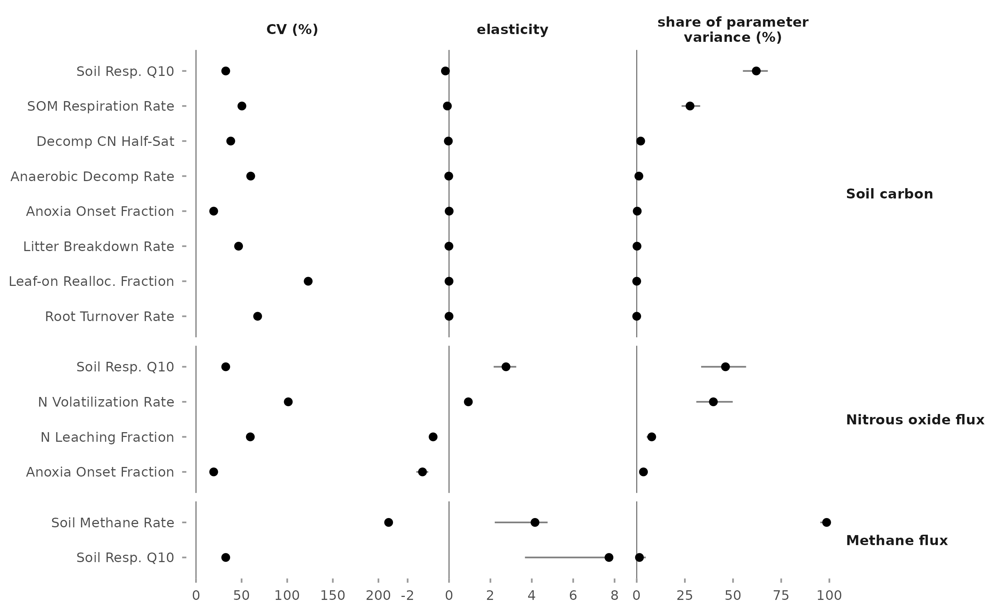
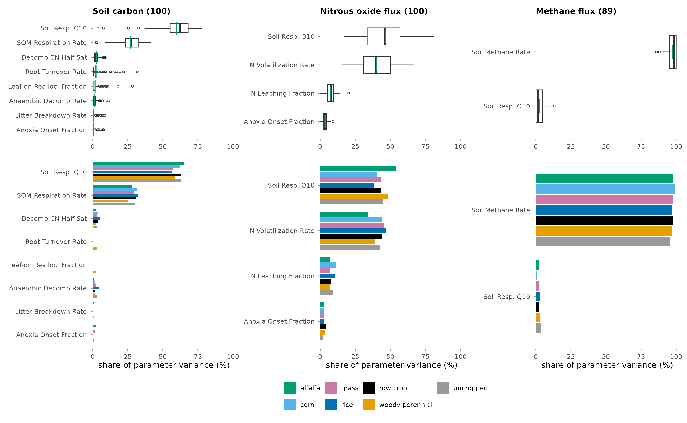
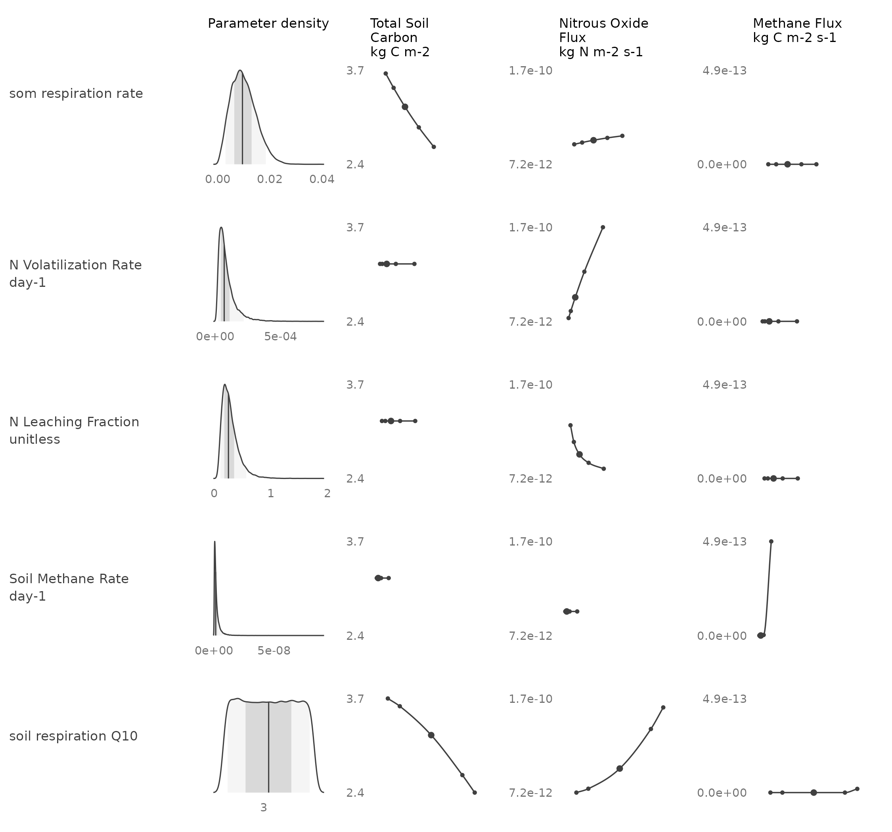

This report ranks the parameters of the SIPNET ecosystem model by their contribution to
the uncertainty of modeled soil carbon and nitrous oxide flux. The analysis covers 100
design points on California cropland over 2016 to 2023. Results are each parameter's
share of parameter variance at each design point.

## Background

A parameter matters for prediction when the model is sensitive to it and its value is
uncertain. The analysis combines the two, following the PEcAn variance decomposition
([LeBauer et al., 2013](references.html); [Dietze et al., 2014](references.html)).

SIPNET is run with every parameter at its prior median, then with each parameter moved
in turn to the 2.3, 15.9, 84.1, and 97.7 percentiles of its prior, all others at their
median. A spline through the five outputs gives the response to that parameter, and the
variance of the prior propagated through the spline is its contribution to the output
variance. The share of parameter variance is that contribution over the sum across all
plant and soil parameters at the design point. A parameter is treated as influential
where its share exceeds 5 percent, the criterion Fer et al. (2018) used to select SIPNET
parameters for calibration ([Fer et al., 2018](references.html)).

{#fig-map width=70% fig-align="center" .lightbox fig-alt="Map of California with 100 design points colored by plant functional type."}

| Setting | Value |
|---|---|
| Model | SIPNET 2.2.0, nitrogen cycle and anaerobic processes on |
| Design points | 100: 67 woody perennial, 14 row crop, 6 grass, 4 alfalfa, 3 rice, 2 corn, 4 uncropped |
| Period | 2016 to 2023, reported as the mean over the period |
| Parameters | 34 per cropped design point (21 plant, 13 soil), 13 per uncropped design point |
| Priors | PFT priors of the statewide inventory runs |
| Meteorology, initial conditions, management | member 1 of each inventory ensemble |
| Model runs | 13,364 |

: Configuration of the analysis. {#tbl-config}

## Share of parameter variance

{#fig-components width=100% fig-align="center" .lightbox fig-alt="Dot plot of coefficient of variation, elasticity, and share of parameter variance for the influential parameters of soil carbon and nitrous oxide flux."}

| Output | Parameter | Median share (%) | Range (%) | Design points over 5 percent |
|---|---|---:|---:|---:|
| Soil carbon | Temperature sensitivity of soil respiration | 62 | 4 to 78 | 99 |
| | Soil organic matter respiration rate | 28 | 2 to 42 | 98 |
| Nitrous oxide flux | Temperature sensitivity of soil respiration | 46 | 17 to 81 | 100 |
| | Nitrogen volatilization rate | 40 | 15 to 67 | 100 |
| | Nitrogen leaching fraction | 8 | 0 to 20 | 76 |

: Share of parameter variance across the 100 design points, for parameters with a median share above 5 percent. {#tbl-shares}

Two soil parameters account for most of the parameter variance in soil carbon, and
raising either lowers soil carbon at all 100 design points. A plant parameter exceeds 5
percent of the soil carbon variance at 19 of the 96 cropped design points, 18 of them
woody perennial, and at none for nitrous oxide.

## Variation across design points and PFTs

{#fig-pft width=100% fig-align="center" .lightbox fig-alt="Box plots of share of parameter variance across design points and bar charts of mean share by plant functional type, for soil carbon and nitrous oxide flux."}

The two parameters with the largest mean share are the same in every PFT for each
output.

## Response to each parameter

{#fig-panel width=80% fig-align="center" .lightbox fig-alt="Grid of prior densities and response curves of soil carbon and nitrous oxide flux for four soil parameters."}

{#fig-curves-soc width=100% fig-align="center" .lightbox fig-alt="Response curves of soil carbon at every design point for the influential parameters."}

{#fig-curves-n2o width=100% fig-align="center" .lightbox fig-alt="Response curves of nitrous oxide flux at every design point for the influential parameters."}

## Reporting scope

Shares are reported for soil carbon and nitrous oxide flux. Methane and six other outputs
were also computed. Modeled methane is near the precision of the model output, and plant
carbon is low in these runs, with net primary productivity below 20 g C m^-2^ yr^-1^ at
the median design point of every PFT; shares for these outputs are not presented.

## Interpretation

These are model-derived results. Parameters are drawn from priors that have not been
updated with observations, so each share depends on the prior widths; the prior for the
temperature sensitivity of soil respiration is uniform from 1.4 to 5.0.

Each parameter is varied with all others at their medians, so the shares divide the sum
of single-parameter contributions and do not include interactions
([Saltelli et al., 2019](references.html)). Meteorology, initial conditions, and
management are held at one ensemble member; the global sensitivity analysis compares
those inputs with the parameters. In SIPNET 2.2.0 the nitrous oxide output is the total
nitrogen volatilization flux.

See [References](references.html) for the cited sources.
