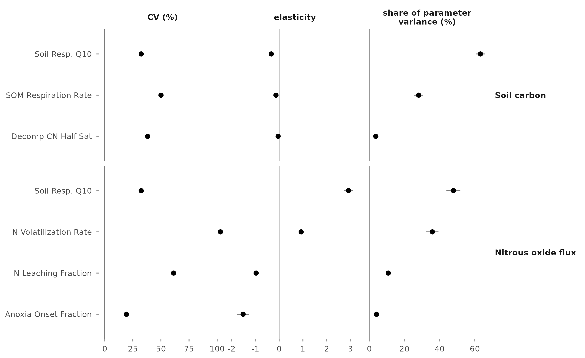

This tutorial runs the two sensitivity analyses of the MAGiC uncertainty workflow on a
small demo dataset. The demo covers two design points: a corn field in the
Sacramento-Delta and a woody perennial field in the San Joaquin Valley, over 2016 to
2023.

Both analyses use the inputs of an ensemble run: meteorology, initial conditions,
management events, and the PFT priors. The local analysis moves each parameter in turn;
the global analysis varies all four inputs together.

This documentation assumes that the steps in [Environment setup](CARB-uncertainty-setup.md)
have been completed. Run all commands below from the uncertainty repository root.

## Fetch demo data

<!-- [check] demo bundle S3 key once it is uploaded -->

```bash
aws s3 sync s3://carb/data/workflows/uncertainty/demo_data/ demo-data/uncertainty/
aws s3 sync s3://carb/pfts/magic_v1.2/ demo-data/pfts/magic_v1.2/
cp demo-data/uncertainty/demo_config.yaml config.yaml
```

The first download holds the ensemble inputs for the two design points:

- `site_info.csv`: the design points, one row each, with their PFT and ERA5 grid cell
- `data/ERA5_SIPNET/`: 10 ERA5 meteorology members per grid cell
- `IC_files/`: initial condition members per design point
- `data/events/`: 20 management event members

The second is the v1.2 parameterization package: one prior file per PFT, plus the
package README.

## Explore the CLI

```bash
./magic-uncertainty help
```

Key points:

- `prepare`, `local-sensitivity`, and `global-sensitivity` each run a fixed list of
  steps, and each step calls one script.
- Every setting reaches a script as a command line argument; scripts do not read
  configuration files or environment variables.
- `--verbose` prints the exact call issued for each step.
- Each command writes a log to `run_dir`.

## Explore the configuration file

```bash
less config.yaml
```

The demo configuration uses these values:

```yaml
run_dir: "uncertainty-demo-run/"
n_sites_local: 2
n_sites_global: 2
sobol_sample_size: 30
example_site: "328163"
n_workers: 4
workflow_parallelism_mode: local
pecan_parallelism_mode: local-gnu-parallel
```

`n_sites_local` and `n_sites_global` take the design points from the top of
`site_info.csv`. `sobol_sample_size` is the base sample of the global analysis; each
design point runs six times that number. `pecan_parallelism_mode: local-gnu-parallel`
runs the model with GNU parallel in the current allocation, on `n_workers` cores. On a
Slurm cluster, `slurm-sbatch` submits the runs as array jobs instead.

The `external_paths` block points at the downloaded inputs and at the SIPNET binary. Set
`sipnet_binary` to the `sipnet.git` in your ensemble run directory.

## Prepare

```bash
./magic-uncertainty prepare --verbose --config config.yaml
```

- links the demo inputs into `run_dir`, so large files are not copied
- copies the two settings templates and inserts the run dispatch chosen in the
  configuration
- builds one settings file for each analysis, under `run_dir/local/` and
  `run_dir/global/`

## Local sensitivity

```bash
./magic-uncertainty local-sensitivity --verbose --config config.yaml
```

SIPNET is run with every parameter at its prior median, then with each parameter moved
in turn to four percentiles of its prior. That is 157 runs at the corn design point. The
command then fits a spline through each parameter's runs, computes each parameter's
share of the parameter variance at each design point, and draws the figures.

Results are in `run_dir/local/`: `local_sensitivity.csv` holds every parameter at every
design point, and `figures/` holds the report figures and `parameter_shares.csv`.

| Output | Parameter | Median share (%) |
|---|---|---:|
| Soil carbon | Soil respiration Q10 | 63 |
| | Base soil respiration rate (0 °C, saturated soil) | 28 |
| Nitrous oxide flux | Soil respiration Q10 | 48 |
| | Nitrogen volatilization rate constant | 36 |
| | Nitrogen leaching fraction | 11 |

: Parameters with a median share above 5 percent across the two demo design points. {#tbl-demo-shares}

{#fig-demo-components .lightbox fig-alt="Dot plot of coefficient of variation, elasticity, and share of parameter variance for the parameters of soil carbon and nitrous oxide flux at the two demo design points."}

## Global sensitivity

```bash
./magic-uncertainty global-sensitivity --verbose --config config.yaml
```

The command draws two samples of 30 rows, each row holding one draw of every parameter
and one member of each input ensemble, and recombines them into a design of 180 rows. It
runs SIPNET for every row at each design point, then computes the first-order and
total-order index of each input with bootstrap intervals.

Results are in `run_dir/global/`: `global_sensitivity.csv` holds the indices and
intervals, and `figures/` holds the report figures and tables.

With a base sample of 30 the intervals are wide, and some estimates fall below 0 or
above 1. The reported analysis uses a base sample of 1,000.

## Scaling beyond the demo

The same three commands run the full analyses. Point `external_paths` at the inputs of a
full ensemble run and set the sizes used in the reports:

```yaml
n_sites_local: 100
n_sites_global: 10
sobol_sample_size: 1000
```

The local analysis then writes 13,364 runs and the global analysis 60,000. On a cluster,
set `pecan_parallelism_mode: slurm-sbatch` so the model runs are submitted as array jobs,
and run the CLI itself on a compute node with `n_workers` set to the cores available.
